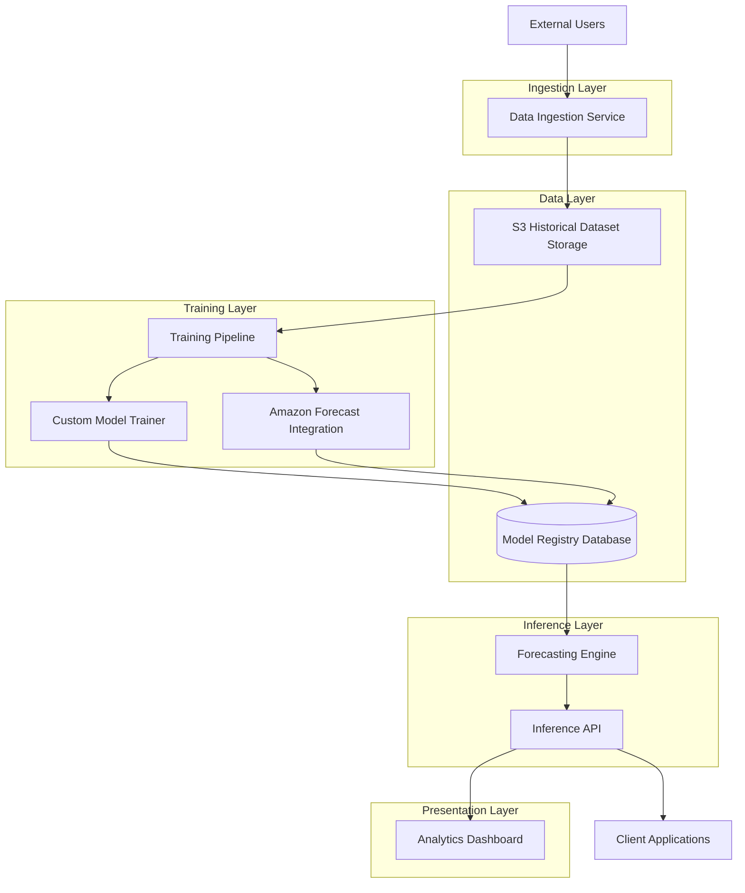

# Design Document: Demand Forecasting System

## Overview

The Demand Forecasting System is a scalable machine learning platform that generates demand predictions using historical sales data enriched with seasonality patterns, holiday effects, and price impacts. The system architecture follows a modular design with distinct components for data ingestion, model training, inference serving, and visualization.

**Core Design Principles:**

1. **Separation of Concerns**: Data ingestion, model training, inference, and presentation are isolated into independent services
2. **Benchmark-Driven Development**: Custom models are systematically compared against Amazon Forecast as an automated baseline
3. **API-First Architecture**: All forecasting capabilities are exposed through REST APIs for integration flexibility
4. **Scalability by Design**: Components are designed to handle millions of records and thousands of concurrent requests

**Key Components:**

- **Data Ingestion Service**: Validates and stores historical time-series data
- **Training Pipeline**: Trains custom models and Amazon Forecast predictors, generates performance metrics
- **Model Registry**: Centralized storage for model artifacts, metadata, and version history
- **Forecasting Engine**: Generates predictions using trained models with confidence intervals
- **Inference API**: REST endpoints for accessing forecasts programmatically
- **Analytics Dashboard**: Web-based visualization for forecasts and model comparison

The system leverages [Amazon Forecast](https://aws.amazon.com/forecast/) as a fully managed forecasting service that provides automated model selection and training. Custom models are developed using standard ML frameworks and compared against Amazon Forecast to validate performance improvements from domain-specific logic.

## Architecture

### System Architecture Diagram



### Component Interactions

**Data Flow:**

1. **Ingestion**: Historical sales data (CSV/JSON) → Data Ingestion Service → Validation → S3 Storage
2. **Training**: S3 Historical Dataset → Training Pipeline → Custom Model Trainer + Amazon Forecast → Model Registry
3. **Inference**: Forecast Request → Inference API → Forecasting Engine → Model Registry → Prediction Response
4. **Visualization**: Dashboard Request → Inference API → Forecasting Engine → JSON Response → Chart Rendering

**Technology Stack:**

- **Data Storage**: Amazon S3 (historical datasets), Amazon RDS PostgreSQL (model registry)
- **Compute**: AWS Lambda (API endpoints), Amazon SageMaker (custom model training), Amazon Forecast (benchmark models)
- **API Framework**: FastAPI (Python) for REST endpoints with automatic OpenAPI documentation
- **ML Libraries**: scikit-learn, statsmodels, or Prophet for custom forecasting models
- **Frontend**: React with Recharts or D3.js for time-series visualization
- **Authentication**: API Gateway with API key authentication

### Deployment Architecture

The system follows a serverless-first approach for cost efficiency and automatic scaling:

- **Inference API**: AWS Lambda functions behind API Gateway
- **Training Pipeline**: AWS Step Functions orchestrating SageMaker training jobs and Forecast predictor creation
- **Data Ingestion**: Lambda functions triggered by S3 uploads or API Gateway endpoints
- **Dashboard**: Static React application hosted on S3 with CloudFront CDN

## Components and Interfaces

### Data Ingestion Service

**Responsibility**: Validate and store historical time-series data for model training.

**Interface:**

```python
class DataIngestionService:
    def ingest_batch(
        self,
        data: Union[pd.DataFrame, List[Dict]],
        format: Literal["csv", "json"]
    ) -> IngestionResult:
        """
        Ingest historical sales data with validation.
        
        Args:
            data: Time-series data with required columns
            format: Input data format
            
        Returns:
            IngestionResult with success status, record count, and errors
            
        Raises:
            ValidationError: If schema validation fails
        """
        pass
    
    def validate_schema(self, data: pd.DataFrame) -> ValidationResult:
        """
        Validate data contains required columns and types.
        
        Required columns:
        - timestamp (datetime)
        - product_id (string)
        - sales_volume (numeric)
        - price (numeric)
        - is_holiday (boolean)
        - season (categorical)
        """
        pass
```

**Validation Rules:**

- Timestamp must be valid datetime format
- Sales volume and price must be non-negative numeric values
- Product ID must be non-empty string
- Holiday indicator must be boolean
- Seasonality features must be present (day_of_week, month, quarter)
- No duplicate (product_id, timestamp) combinations
- Maximum 5 million records per batch

### Training Pipeline

**Responsibility**: Train custom models and Amazon Forecast predictors, compute performance metrics, register models.

**Interface:**

```python
class TrainingPipeline:
    def train_custom_model(
        self,
        dataset_id: str,
        model_config: ModelConfig
    ) -> TrainingResult:
        """
        Train custom forecasting model on historical dataset.
        
        Args:
            dataset_id: Reference to historical dataset in S3
            model_config: Hyperparameters and feature configuration
            
        Returns:
            TrainingResult with model_id, metrics, and training metadata
        """
        pass
    
    def train_forecast_predictor(
        self,
        dataset_id: str,
        forecast_horizon: int
    ) -> TrainingResult:
        """
        Create and train Amazon Forecast predictor.
        
        Args:
            dataset_id: Reference to historical dataset in S3
            forecast_horizon: Number of time steps to forecast
            
        Returns:
            TrainingResult with predictor ARN and metrics
        """
        pass
    
    def compute_metrics(
        self,
        predictions: np.ndarray,
        actuals: np.ndarray
    ) -> PerformanceMetrics:
        """
        Calculate forecasting accuracy metrics.
        
        Returns:
            PerformanceMetrics with MAE, RMSE, MAPE
        """
        pass
    
    def generate_comparison_report(
        self,
        custom_metrics: PerformanceMetrics,
        benchmark_metrics: PerformanceMetrics
    ) -> ComparisonReport:
        """
        Compare custom model against benchmark.
        
        Returns:
            ComparisonReport with relative performance and recommendations
        """
        pass
```

**Training Process:**

1. Load historical dataset from S3
2. Split data into train/validation sets (80/20 split)
3. Extract seasonality features (day_of_week, month, quarter)
4. Train custom model using scikit-learn or Prophet
5. Simultaneously create Amazon Forecast predictor via boto3 API
6. Compute backtesting metrics on validation set
7. Register both models in Model Registry with version metadata
8. Generate comparison report

**Performance Metrics:**

- **MAE (Mean Absolute Error)**: Average absolute difference between predictions and actuals
- **RMSE (Root Mean Squared Error)**: Square root of average squared differences, penalizes large errors
- **MAPE (Mean Absolute Percentage Error)**: Average percentage error, scale-independent

Content rephrased for compliance with licensing restrictions. Formulas sourced from [standard forecasting literature](https://www.numberanalytics.com/blog/forecast-accuracy-metrics-time-series-models).

### Model Registry

**Responsibility**: Store and retrieve trained model artifacts with metadata.

**Interface:**

```python
class ModelRegistry:
    def register_model(
        self,
        model_artifact: bytes,
        metadata: ModelMetadata
    ) -> str:
        """
        Store model artifact and metadata.
        
        Args:
            model_artifact: Serialized model (pickle or joblib)
            metadata: Version, metrics, training config, dataset reference
            
        Returns:
            model_id: Unique identifier for registered model
        """
        pass
    
    def get_model(self, model_id: str) -> Tuple[bytes, ModelMetadata]:
        """Retrieve model artifact and metadata by ID."""
        pass
    
    def list_models(
        self,
        product_id: Optional[str] = None,
        model_type: Optional[Literal["custom", "forecast"]] = None
    ) -> List[ModelMetadata]:
        """List available models with optional filtering."""
        pass
    
    def get_latest_model(
        self,
        product_id: str,
        model_type: Literal["custom", "forecast"]
    ) -> Tuple[str, ModelMetadata]:
        """Get most recent model version for a product."""
        pass
```

**Storage Schema:**

```sql
CREATE TABLE models (
    model_id VARCHAR(255) PRIMARY KEY,
    product_id VARCHAR(255) NOT NULL,
    model_type VARCHAR(50) NOT NULL,  -- 'custom' or 'forecast'
    version INTEGER NOT NULL,
    artifact_s3_path VARCHAR(512) NOT NULL,
    training_dataset_id VARCHAR(255) NOT NULL,
    mae DECIMAL(10, 4),
    rmse DECIMAL(10, 4),
    mape DECIMAL(10, 4),
    hyperparameters JSONB,
    created_at TIMESTAMP DEFAULT CURRENT_TIMESTAMP,
    INDEX idx_product_type (product_id, model_type),
    INDEX idx_created (created_at DESC)
);
```

### Forecasting Engine

**Responsibility**: Generate demand predictions using trained models with confidence intervals.

**Interface:**

```python
class ForecastingEngine:
    def generate_forecast(
        self,
        model_id: str,
        forecast_horizon: int,
        future_features: Optional[Dict] = None
    ) -> ForecastResult:
        """
        Generate demand forecast for specified horizon.
        
        Args:
            model_id: Model to use for prediction
            forecast_horizon: Number of time steps to forecast (1-90 days)
            future_features: Optional future values for price, holidays
            
        Returns:
            ForecastResult with predictions and confidence intervals
        """
        pass
    
    def generate_multi_model_forecast(
        self,
        product_id: str,
        forecast_horizon: int,
        future_features: Optional[Dict] = None
    ) -> Dict[str, ForecastResult]:
        """
        Generate forecasts from all available models for comparison.
        
        Returns:
            Dictionary mapping model_id to ForecastResult
        """
        pass
```

**Forecast Result Structure:**

```python
@dataclass
class ForecastResult:
    model_id: str
    product_id: str
    timestamps: List[datetime]
    predictions: List[float]
    confidence_intervals: Dict[str, Tuple[List[float], List[float]]]  # {50%, 80%, 90%}
    metadata: Dict[str, Any]
```

**Confidence Interval Calculation:**

For custom models, confidence intervals are computed using quantile regression or bootstrap resampling. Amazon Forecast provides quantile forecasts (p10, p50, p90) natively through its API.

### Inference API

**Responsibility**: Expose forecasting capabilities through REST endpoints.

**Endpoints:**

```
POST /api/v1/forecast
GET  /api/v1/forecast/{forecast_id}
GET  /api/v1/models
GET  /api/v1/models/{model_id}
POST /api/v1/data/ingest
GET  /api/v1/health
```

**Request/Response Schemas:**

```python
# POST /api/v1/forecast
class ForecastRequest(BaseModel):
    product_id: str
    forecast_horizon: int = Field(ge=1, le=90)
    model_id: Optional[str] = None  # If None, use latest custom model
    include_benchmark: bool = False
    future_features: Optional[Dict[str, Any]] = None

class ForecastResponse(BaseModel):
    forecast_id: str
    product_id: str
    model_id: str
    timestamps: List[datetime]
    predictions: List[float]
    confidence_intervals: Dict[str, ConfidenceInterval]
    benchmark: Optional[ForecastResult] = None
    metadata: Dict[str, Any]

class ConfidenceInterval(BaseModel):
    level: str  # "50%", "80%", "90%"
    lower: List[float]
    upper: List[float]
```

**Error Handling:**

- 400 Bad Request: Invalid parameters (negative horizon, missing product_id)
- 404 Not Found: Model or product not found in registry
- 429 Too Many Requests: Rate limit exceeded (>1000 req/min)
- 500 Internal Server Error: Model loading or prediction failure
- 503 Service Unavailable: Forecasting engine unavailable

**Authentication:**

API key authentication via `X-API-Key` header. Keys are managed through AWS API Gateway and validated on each request.

### Analytics Dashboard

**Responsibility**: Visualize forecasts and model performance for business users.

**Features:**

1. **Time Series Chart**: Historical sales + future forecasts with confidence intervals
2. **Model Comparison View**: Side-by-side custom vs. benchmark forecasts
3. **Performance Metrics Table**: MAE, RMSE, MAPE for each model
4. **Product Selector**: Dropdown to switch between products
5. **Horizon Slider**: Adjust forecast horizon (1-90 days)
6. **Date Range Filter**: Focus on specific time periods

**Component Structure:**

```typescript
interface DashboardProps {
  apiBaseUrl: string;
  apiKey: string;
}

interface ForecastChartProps {
  historicalData: TimeSeriesPoint[];
  forecastData: ForecastResult;
  showConfidenceIntervals: boolean;
}

interface ModelComparisonProps {
  customForecast: ForecastResult;
  benchmarkForecast: ForecastResult;
}
```

**Data Flow:**

1. User selects product and horizon
2. Dashboard calls `POST /api/v1/forecast` with `include_benchmark=true`
3. Receives forecast data with confidence intervals
4. Renders time-series chart using Recharts library
5. Displays metrics in comparison table

## Data Models

### Historical Dataset Schema

```python
@dataclass
class HistoricalRecord:
    timestamp: datetime
    product_id: str
    sales_volume: float
    price: float
    is_holiday: bool
    day_of_week: int  # 0-6
    month: int  # 1-12
    quarter: int  # 1-4
    season: str  # "spring", "summer", "fall", "winter"
```

**Storage Format**: Parquet files in S3 partitioned by product_id and year for efficient querying.

### Model Metadata Schema

```python
@dataclass
class ModelMetadata:
    model_id: str
    product_id: str
    model_type: Literal["custom", "forecast"]
    version: int
    artifact_path: str  # S3 path
    training_dataset_id: str
    mae: float
    rmse: float
    mape: float
    hyperparameters: Dict[str, Any]
    created_at: datetime
    forecast_horizon: int
```

### Training Configuration Schema

```python
@dataclass
class ModelConfig:
    algorithm: Literal["prophet", "arima", "xgboost"]
    hyperparameters: Dict[str, Any]
    features: List[str]  # ["price", "is_holiday", "seasonality"]
    train_test_split: float = 0.8
    forecast_horizon: int = 30
```

### Validation Result Schema

```python
@dataclass
class ValidationResult:
    is_valid: bool
    errors: List[ValidationError]
    warnings: List[str]
    record_count: int

@dataclass
class ValidationError:
    field: str
    error_type: str  # "missing", "invalid_type", "out_of_range"
    message: str
    row_indices: List[int]
```

### Performance Metrics Schema

```python
@dataclass
class PerformanceMetrics:
    mae: float
    rmse: float
    mape: float
    sample_size: int
    evaluation_period: Tuple[datetime, datetime]

@dataclass
class ComparisonReport:
    custom_metrics: PerformanceMetrics
    benchmark_metrics: PerformanceMetrics
    mae_improvement: float  # Percentage improvement
    rmse_improvement: float
    mape_improvement: float
    recommendation: str  # "Use custom model" or "Use benchmark"
```


## Correctness Properties

*A property is a characteristic or behavior that should hold true across all valid executions of a system—essentially, a formal statement about what the system should do. Properties serve as the bridge between human-readable specifications and machine-verifiable correctness guarantees.*

### Property 1: Schema Validation Completeness

*For any* dataset submitted to the Data Ingestion Service, validation SHALL identify all schema violations including missing required columns, incorrect data types, and invalid value ranges.

**Validates: Requirements 1.1, 9.5**

### Property 2: Validation Error Message Accuracy

*For any* dataset with schema violations, the validation error messages SHALL contain the specific field names and error types corresponding to each violation.

**Validates: Requirements 1.2**

### Property 3: Valid Data Acceptance

*For any* dataset containing all required columns (timestamp, product_id, sales_volume, price, is_holiday, seasonality features) with correct data types and valid value ranges, the Data Ingestion Service SHALL accept the data without validation errors.

**Validates: Requirements 1.3**

### Property 4: Format Parsing Round-Trip

*For any* valid historical dataset, serializing to CSV or JSON format and then parsing back SHALL produce an equivalent dataset with the same values and structure.

**Validates: Requirements 1.5**

### Property 5: Metric Calculation Correctness

*For any* pair of prediction and actual value arrays, the computed MAE, RMSE, and MAPE metrics SHALL match their mathematical definitions: MAE as mean absolute difference, RMSE as square root of mean squared difference, and MAPE as mean absolute percentage error.

**Validates: Requirements 2.2, 8.2**

### Property 6: Comparison Report Calculation

*For any* pair of performance metrics (custom and benchmark), the comparison report SHALL correctly calculate percentage improvements for MAE, RMSE, and MAPE, and the improvement values SHALL be consistent with the formula: ((benchmark_metric - custom_metric) / benchmark_metric) * 100.

**Validates: Requirements 3.4, 8.3**

### Property 7: Forecast Result Structure Completeness

*For any* forecast result generated by the Forecasting Engine or returned by the Inference API, the result SHALL include all required fields: timestamps, predictions, confidence intervals at 50%, 80%, and 90% levels, and model metadata.

**Validates: Requirements 4.3, 5.3**

### Property 8: API Request Parameter Validation

*For any* API request to the Inference API, the parameter validation SHALL correctly identify invalid product identifiers, out-of-range forecast horizons (not in 1-90), and missing required fields.

**Validates: Requirements 5.1, 10.4**

### Property 9: API Error Response Format

*For any* invalid API request, the Inference API SHALL return an HTTP 400 status code with a JSON error response containing a descriptive error message that identifies the validation failure.

**Validates: Requirements 5.4**

### Property 10: Seasonality Feature Extraction

*For any* timestamp, the feature engineering logic SHALL correctly extract day-of-week (0-6), month (1-12), and quarter (1-4) values that match the timestamp's calendar position.

**Validates: Requirements 9.1**

### Property 11: HTTP Status Code Mapping

*For any* error condition in the Inference API, the error SHALL map to the correct HTTP status code: 400 for validation errors, 404 for missing resources, 500 for internal errors, and 503 for service unavailability.

**Validates: Requirements 10.2**

### Property 12: Exponential Backoff Retry Timing

*For any* sequence of transient failures when communicating with Amazon Forecast, the retry logic SHALL implement exponential backoff where each retry delay is calculated as: base_delay * (2 ^ attempt_number), with appropriate jitter and maximum retry limits.

**Validates: Requirements 10.3**

## Error Handling

### Error Categories

**Validation Errors:**
- Schema validation failures (missing columns, wrong types)
- Value range violations (negative sales, invalid dates)
- Duplicate records (same product_id and timestamp)
- Format parsing errors (malformed CSV/JSON)

**Resource Errors:**
- Model not found in registry
- Dataset not found in S3
- Product ID not in system

**Service Errors:**
- Amazon Forecast API failures
- Model Registry database connection failures
- S3 storage unavailability
- Model loading failures

**Rate Limiting:**
- Request rate exceeds 1000/minute threshold
- Concurrent request limit exceeded

### Error Response Format

All API errors follow a consistent JSON structure:

```json
{
  "error": {
    "code": "VALIDATION_ERROR",
    "message": "Invalid forecast horizon: must be between 1 and 90 days",
    "details": {
      "field": "forecast_horizon",
      "provided_value": 120,
      "valid_range": [1, 90]
    },
    "timestamp": "2025-01-15T10:30:00Z",
    "request_id": "req_abc123"
  }
}
```

### Retry Strategy

**Transient Failures** (Amazon Forecast API, S3 operations):
- Implement exponential backoff: base delay 1 second, max 5 retries
- Retry on: 429 (rate limit), 500 (internal error), 503 (service unavailable)
- Do not retry on: 400 (bad request), 404 (not found)

**Circuit Breaker Pattern**:
- Open circuit after 5 consecutive failures
- Half-open state after 30 seconds
- Close circuit after 2 successful requests

### Logging Strategy

All components log structured JSON with:
- Timestamp (ISO 8601)
- Component name
- Log level (DEBUG, INFO, WARN, ERROR)
- Message
- Context (request_id, user_id, model_id)
- Error details (stack trace for errors)

**Log Aggregation**: CloudWatch Logs with log groups per component.

## Testing Strategy

### Testing Approach

The Demand Forecasting System requires a comprehensive testing strategy that combines property-based testing for pure logic components with integration testing for AWS service interactions and UI components.

### Property-Based Testing

**Applicable Components:**
- Data validation logic
- Metric calculations (MAE, RMSE, MAPE)
- Feature engineering transformations
- API request/response serialization
- Error handling and status code mapping

**Testing Framework**: Hypothesis (Python) for property-based testing

**Configuration:**
- Minimum 100 iterations per property test
- Each test tagged with: `Feature: demand-forecasting-system, Property {number}: {property_text}`

**Example Property Test Structure:**

```python
from hypothesis import given, strategies as st
import pytest

@given(
    predictions=st.lists(st.floats(min_value=0, max_value=10000), min_size=10),
    actuals=st.lists(st.floats(min_value=0, max_value=10000), min_size=10)
)
def test_mae_calculation_correctness(predictions, actuals):
    """
    Feature: demand-forecasting-system, Property 5: Metric Calculation Correctness
    
    For any pair of prediction and actual value arrays, the computed MAE
    SHALL match its mathematical definition.
    """
    # Ensure same length
    min_len = min(len(predictions), len(actuals))
    predictions = predictions[:min_len]
    actuals = actuals[:min_len]
    
    # Compute MAE using system function
    mae = compute_mae(predictions, actuals)
    
    # Compute expected MAE
    expected_mae = sum(abs(p - a) for p, a in zip(predictions, actuals)) / len(predictions)
    
    # Verify match within floating point tolerance
    assert abs(mae - expected_mae) < 1e-6
```

**Property Test Coverage:**

| Property | Test Focus | Generator Strategy |
|----------|-----------|-------------------|
| 1 | Schema validation | Random datasets with missing/invalid columns |
| 2 | Error messages | Invalid datasets with known violations |
| 3 | Valid data acceptance | Random valid datasets with all required fields |
| 4 | Format round-trip | Random datasets serialized to CSV/JSON |
| 5 | Metric calculations | Random prediction/actual pairs |
| 6 | Comparison reports | Random metric pairs |
| 7 | Forecast structure | Random forecast results |
| 8 | API validation | Random valid/invalid API requests |
| 9 | Error responses | Random invalid requests |
| 10 | Feature extraction | Random timestamps across years |
| 11 | Status code mapping | Random error conditions |
| 12 | Retry timing | Random failure sequences |

### Unit Testing

**Focus Areas:**
- Specific edge cases (empty datasets, single-record datasets)
- Error handling for specific scenarios (missing model, invalid API key)
- Configuration parsing and validation
- Utility functions and helpers

**Framework**: pytest with fixtures for common test data

### Integration Testing

**AWS Service Integration:**
- Amazon Forecast predictor creation and training
- S3 data upload and retrieval
- Model Registry database operations
- API Gateway authentication

**Test Environment**: Dedicated AWS account with isolated resources

**Mocking Strategy**: Use moto for S3, localstack for local development

### End-to-End Testing

**Scenarios:**
1. Complete training pipeline: data ingestion → training → model registration
2. Forecast generation: API request → model loading → prediction → response
3. Model comparison: train custom + benchmark → generate comparison report
4. Dashboard workflow: user interaction → API calls → visualization

**Tools**: Selenium for dashboard testing, pytest for API workflows

### Performance Testing

**Load Testing:**
- Inference API: 1000 requests/minute sustained load
- Data ingestion: 5 million record batches
- Concurrent forecast requests: 100 simultaneous users

**Tools**: Locust for load testing, CloudWatch for monitoring

### Acceptance Testing

Each requirement's acceptance criteria will be validated through:
- Property tests for pure logic (validation, calculations)
- Integration tests for AWS services (Forecast, S3, RDS)
- UI tests for dashboard (Selenium)
- Performance tests for scalability requirements

**Traceability**: Each test references its requirement number in docstring or test name.

### Continuous Integration

**CI Pipeline:**
1. Unit tests + property tests (every commit)
2. Integration tests (every PR)
3. E2E tests (nightly)
4. Performance tests (weekly)

**Coverage Target**: 80% code coverage for pure logic components

### Test Data Management

**Synthetic Data Generation:**
- Historical sales data with realistic patterns (seasonality, trends)
- Holiday calendars for multiple years
- Price variation scenarios

**Data Privacy**: No real customer data in test environments
